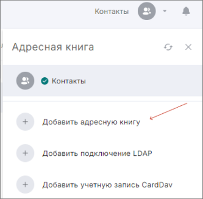
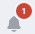

Вы можете подключить несколько адресных книг LDAP для работы с контактами.  

1. Перейдите в раздел **Контакты**.  
2. Откройте правую боковую панель, нажав в правом верхнем углу на выбранную адресную книгу.  
3. Выберите **Добавить подключение LDAP**.  
    

4. Заполните поля.  
5. Нажмите кнопку **Сохранить**.    

При успешном подключении в список **Все контакты** добавляются контакты адресной книги LDAP.    

При выборе активной адресной книги LDAP в левом боковом меню отображаются папки LDAP.  

## Описание полей формы подключения адресной книги   

- **Название каталога LDAP** — произвольное название для адресной книги.  
- **Сведения о сервере** — имя сервера и порт.  
- **Данные для входа в систему** — имя пользователя и пароль.  
- **База поиска** — по умолчанию или другая.  
- **Параметры сервера** — время ожидания, не возвращать более чем N результатов, фильтр поиска и база поиска.  
- **Параметры синхронизации** — частота обновления каталога.  
   
Если при подключении адресной книги возникает ошибка, она выводится как уведомление в правом верхнем углу. Вы можете посмотреть уведомления, нажав на иконку.    

Для просмотра подробного описания ошибки или отправки в техническую поддержку нажмите кнопку **Перейти в журнал** в правой боковой панели списка уведомлений.  

## Возможные уведомления    

**Не удалось подключиться к LDAP** — проверьте правильность заполнения полей **Имя сервера** и **Порт**. Проверьте **Имя пользователя** и **Пароль**.  

## Инструкции по теме

1. [Как переключаться между адресными книгами.](./08-select-books.md)  
2. [Как редактировать адресную книгу LDAP.](./07-edit-ldap.md)  
3. [Как удалить адресную книгу LDAP.](./11-delete-ldap.md)  
4. [Как посмотреть информацию о контакте.](./04-view-contact.md)  
5. [Как посмотреть уведомления.](../008-cryptoarm/01-notifications.md)  