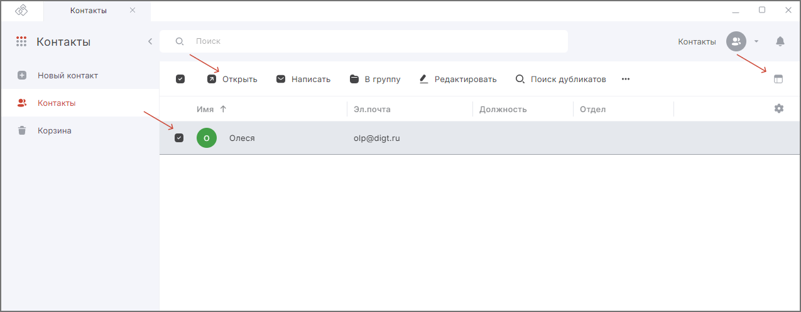

## Быстрый просмотр  

1. Перейдите в раздел **Контакты**.  
2. Выделите контакт в списке нажатием курсора.  
3. Нажмите кнопку **Просмотреть**.   

Область просмотра контакта отображается в правой боковой панели.  

## Просмотр в новой вкладке    

1. Перейдите в раздел **Контакты**.  
2. Выделите контакт в списке нажатием курсора.  
3. На верхней панели нажмите кнопку **Открыть**.    

Информация о контакте открывается для просмотра в новой вкладке. 

Вы можете написать письмо контакту и удалить контакт.     

## Инструкции по теме

1. [Как редактировать локальный контакт.](./06-edit-contact.md)  
2. [Как переключаться между адресными книгами.](./08-select-books.md)  