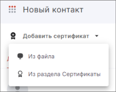

Чтобы шифровать документы в адрес контакта, нужно привязать сертификат к контакту.  

Данная функция доступна только для локальных контактов.  

Вы можете привязать сертификат из уже установленных сертификатов или из файла.  

***Важно:*** чтобы привязать сертификат, у вас на рабочем месте должен быть установлен криптопровайдер КриптоПро CSP.    

## Привязка сертификата из установленных сертификатов  

Вы можете привязать сертификат из хранилища **Личные сертификаты** и сертификатов **Других пользователей**.  

Если у вас в хранилище нет сертификатов, вы можете импортировать сертификат или выполнить привязку сертификата из файла.  

Чтобы привязать сертификат из установленных, выполните следующие шаги:

1. Откройте форму создания или редактирования контакта.  
2. Нажмите кнопку **Добавить сертификат** — **Из раздела Сертификаты**.  
    

3. В правой боковой панели выберите сертификат, который будет привязан к контакту, нажав на иконку сертификата.  Возможен множественный выбор. Сертификат автоматически добавляется в список привязанных сертификатов, доступный на вкладке **Сертификат** контакта.    
4. Закройте боковую панель после выбора нужных сертификатов.  
5. Нажмите кнопку **Сохранить**.  

## Привязка сертификата из файла  

Если у вас нет сертификатов в хранилище **Личные сертификаты** и сертификатов **Других пользователей**, вы можете выполнить привязку сертификата из файла. Сертификат установится в хранилище сертификатов **Других пользователей**.  

Чтобы привязать сертификат из файла, выполните следующие шаги:

1. Откройте форму создания или редактирования контакта.  
2. Нажмите кнопку **Добавить сертификат** — **Из файла**.  
3. Выберите файл сертификата в файловом менеджере.    
    Сертификат добавляется в список привязанных сертификатов, доступный на вкладке **Сертификат** контакта.  
4. Нажмите кнопку **Сохранить**.  

## Привязка сертификата к контакту из раздела сертификатов  

1. Перейдите в раздел **Сертификаты**.  
2. Выберите категорию **Других пользователей**.  
3. Выделите сертификат в списке.  
4. На верхней панели действий нажмите кнопку **Привязать к контакту**.  
5. В правой боковой панели из списка выберите контакт, к которому будет привязан сертификат.  

Сертификат успешно привязан к контакту.  

## Инструкции по теме

1. [Как добавить локальный контакт.](./02-add-contact.md)  
2. [Как редактировать локальный контакт.](./06-edit-contact.md)  
3. [Как импортировать сертификаты других пользователей.](../006-certs/06-import-certs.md)    