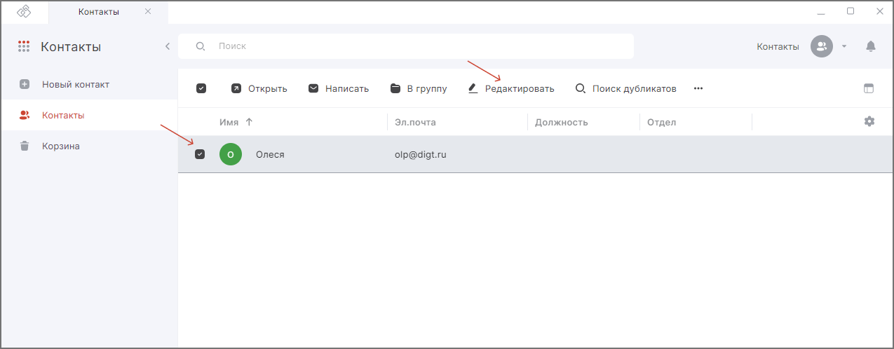

Вы можете редактировать только локальные контакты. Контакты LDAP доступны только для просмотра.  

Для редактирования локального контакта:

1. Перейдите в раздел **Контакты**.  
2. Выделите контакт в списке, который вы хотите изменить.  
3. Нажмите кнопку **Редактировать** в верхней панели.  
    

4. Измените нужные поля.  
5. Нажмите кнопку **Сохранить**.  

## Инструкции по теме

1. [Как добавить локальный контакт.](./02-add-contact.md)  
2. [Как привязать сертификат к контакту.](./05-link-contact-cert.md)  
