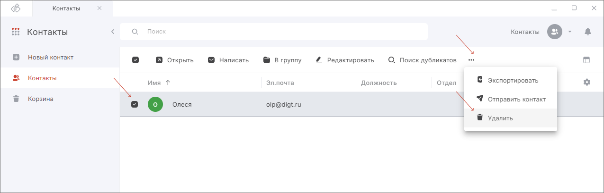

Удаленные контакты хранятся в корзине.  

Вы можете удалить только локальные контакты. Контакты адресной книги LDAP недоступны для редактирования и удаляются при удалении адресной книги.  

## Удаление отдельного контакта  

1. Перейдите в раздел **Контакты**.  
2. Выделите контакт в списке нажатием курсора.  
3. В верхней панели нажмите на кнопку **Удалить**.  

## Удаление нескольких контактов одновременно  

1. Перейдите в раздел **Контакты**.  
2. Установите флажки слева от контактов.  
3. В верхней панели нажмите на кнопку **Удалить**.  

## Удаление всех контактов   

1. Перейдите в раздел **Контакты**.  
2. Выберите все контакты, установив флажок в левом верхнем углу.   
3. В верхней панели нажмите на кнопку **Удалить**.  

## Очищение корзины  

1. Перейдите в раздел **Контакты**.  
2. В левом боковом меню выберите **Корзина**.  
3. Установите флажки напротив контактов, которые хотите навсегда удалить, и нажмите кнопку **Удалить навсегда**.    

***Примечание:*** параметр **Удалить навсегда** доступен только в корзине.   

Чтобы удалить все контакты в корзине, выделите все контакты в корзине и нажмите на кнопку **Удалить навсегда** на панели действий.  

## Инструкции по теме

1. [Как восстановить удаленные контакты из корзины.](./10-restore-contacts.md)  
2. [Как удалить адресную книгу LDAP.](./11-delete-ldap.md)  