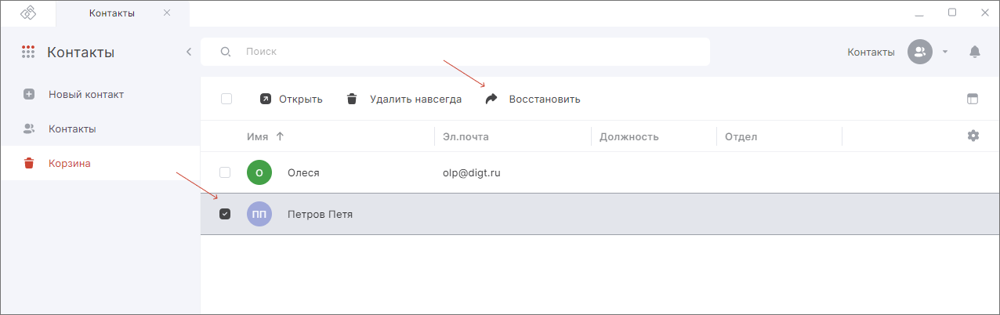

После переноса контакта в корзину его можно восстановить.  

Для этого необходимо выполнить следующие шаги:

1. Перейдите в раздел **Контакты**.  
2. В левом боковом меню выберите **Корзина**.  
3. Установите флажки напротив контактов, которые нужно восстановить.  
4. В верхней панели нажмите на кнопку **Восстановить**.  

