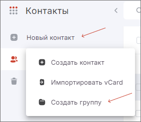
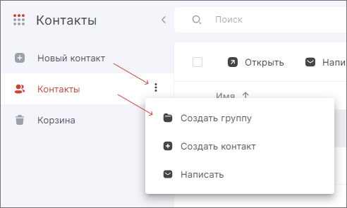
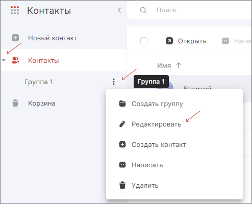
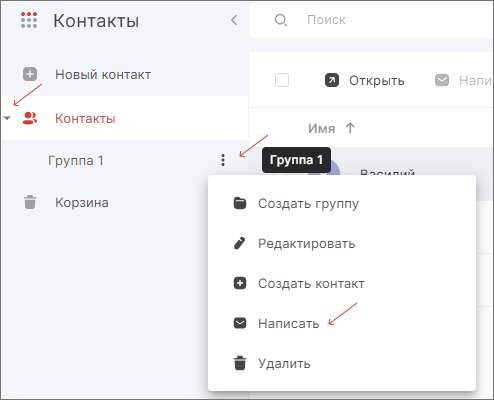

Группа контактов позволяет разделить все контакты по тем или иным признакам. Контакты распределяются по группам по желанию пользователя. Можно создавать несколько уровней вложенности.  

## Создание группы контактов  

Группу контактов можно создать несколькими способами.  

**Первый способ:**

1. Открыть раздел **Контакты**.  
2. Нажать на **Новый контакт** — **Создать группу**.  
3. В открывшемся окне указать название группы и уровень вложенности (в **Контакты** или в ранее созданную группу).  

Созданная группа будет видна во вкладке **Контакты**.  

**Второй способ:**

1. Открыть раздел **Контакты**.  
2. Нажать на контекстное меню вкладки **Контакты** — **Создать группу**.  
3. В открывшемся окне указать название группы и уровень вложенности (в **Контакты** или в ранее созданную группу). 

## Действия с группой контактов  

Доступны следующие действия для группы контактов:

1. **Создать группу** — откроется окно создания группы контактов с назначенным уровнем вложенности.  
2. **Редактировать** — можно изменить название группы и уровень вложенности.  
3. **Создать контакт** — откроется окно создания контакта с назначенной вложенностью в выбранную группу.  
4. **Написать** — откроется вкладка нового сообщения с электронными адресами получателей, которые состоят в данной группе.  
5. **Удалить** — откроется окно подтверждения удаления группы.   

## Редактирование группы  

1. Открыть раздел **Контакты**.  
2. Нажать на контекстное меню нужной группы контактов.  
3. Выбрать **Редактировать**.  
4. Изменить название и (или) уровень вложенности группы.  
5. **Сохранить** изменения.  

## Отправка писем контактам одной группы  

1. Открыть раздел **Контакты**.  
2. Нажать на контекстное меню нужной группы контактов.  
3. Выбрать **Написать**.  
4. Написать письмо.  
5. Нажать на **Отправить**.  

## Удаление группы контактов  

1. Открыть раздел **Контакты**.  
2. Нажать на контекстное меню нужной группы контактов.  
3. Выбрать **Удалить**.  
4. Подтвердить удаление группы, её подгрупп и контактов.  

