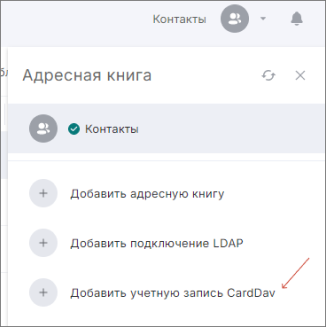

**CardDAV** — это протокол адресной книги, предназначенный для предоставления пользователям доступа к данным на сервере.  

## Добавление адресной книги по протоколу CardDAV  

Для добавления адресной книги по протоколу CardDAV:

1. Открыть раздел **Контакты**.  
2. Открыть правое боковое меню с адресными книгами.  
3. Нажать на **Добавить учётную запись CardDAV**.  
4. В открывшейся вкладке заполнить данные.  
5. **Сохранить**.  

## Поля формы добавления адресной книги по протоколу CardDAV  

На форме добавления адресной книги по протоколу CardDAV доступны следующие поля:

1. **Название адресной книги**.  
2. **Сведения о сервере**: адрес сервиса.  
3. **Вход в систему**: имя пользователя (e-mail) и пароль (для добавления адресной книги необходимо создать пароль для приложения CardDAV в настройках почтового сервиса).  
4. **Параметры синхронизации**: порядок синхронизации (в обе стороны, с сервиса на устройство или с устройства на сервис) и интервал обновления (частота синхронизации адресной книги с почтовым сервисом; возможны варианты обновления никогда, раз в 5/30/60 минут и раз в сутки).  
5. **Сохранять новые локальные контакты в учётную запись CardDAV**.  
