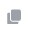
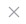

## Общее описание  

Информация о событиях, происходящих в рамках приложения, записывается в журнал событий.   

Можно перейти в журнал, нажав в левой верхней панели на кнопку **События** — **Перейти в журнал**.  

При возникновении уведомления нажать кнопку **Перейти в журнал** в правой боковой панели списка уведомлений.   

События в журнале разделяются по уровням логирования:

- **Информация** включает в себя все сообщения, информирующие о действиях, например, операция подписи, экспорт сертификата, синхронизация почты.  
- **Ошибка** сообщает об ошибках в работе приложения.  

Можно обновить события в журнале, нажав кнопку **Обновить**.  

## Просмотр подробной информации события  

Для просмотра подробной информации о событии выделите запись в списке журнала и нажмите иконку просмотра.    

В правой боковой панели отображается подробная информация.  

Можно скопировать ее для отправки в техническую поддержку, нажав на кнопку **Скопировать**.   

## Сохранение выделенных событий в файл  

Вы можете сохранить выбранные в списке события в файл. Для этого: 

1. Выделите с помощью флагов нужные события.  
2. На верхней панели действий нажмите на кнопку **Сохранить**.  
3. В файловом менеджере задайте имя и расположение файла .log.  

Выделенные события сохраняются в созданный файл .log.  

## Отправка выделенных событий вложением в письме  

Можно отправить информацию из журнала событий письмом из программы.  

Для этого выделите с помощью флагов события и нажмите на кнопку **Отправить**.

Открывается вкладка нового сообщения с прикрепленным файлом журнала в формате .log.  

## Печать событий  

Чтбы распечатать подробную информацию о выбранных в списке событий, выполните следующие действия:

1. Выделите с помощью флагов события.  
2. На верхней панели действий нажмите на кнопку **Распечатать**.  

## Параметры журнала  

В программе можно настроить размер журнала и уровни логирования. Для этого:

1. На панели действий нажмите на кнопку **Параметры журнала**.  
2. В разделе общих настроек на вкладке **Параметры журнала событий** задайте размер журнала и уровень логирования. Общие параметры, такие как имя, расположение, даты создания и изменения, недоступны для редактирования и являются информационными.  
Максимальный размер журнала — 5 МБ.  
3. Нажмите на кнопку **Сохранить** для применения изменений.  

При достижении максимального размера файла создается новый журнал без перезаписи старого. Старый журнал становится архивным.  

Вы можете в параметрах журнала перейти к расположению файла событий, нажав на ссылку поля **Расположен**.  

## Загрузка архивного журнала  

Можно посмотреть события из архивного журнала. Для этого: 

1. На панели действий нажмите на кнопку **Загрузить архив**.  
2. Укажите путь к файлу с архивным журналом.  
   
Архивная копия открывается в новой вкладке.  

**Для событий архивного журнала доступны:**   

-  сохранение в файл;  
-  отправка вложением в письме;  
-  печать.  

## Просмотр расположения файла событий  

Вы можете перейти к расположению файла событий, нажав в дополнительном меню на кнопку **Показать в папке**.  

## Сортировка и фильтрация  

Cписок сообщений можно в журнале по любому из столбцов. По умолчанию журнал отсортирован по дате, начиная от последнего события.  

Для фильтрации журнала используется строка поиска.    

Вы можете воспользоваться быстрым поиском по символьному совпадению, тогда в журнале останутся только записи, удовлетворяющие запросу.   

Для более детальной фильтрации вы можете задать параметры. Для этого в строке поиска нажмите на кнопку **Открыть фильтр**.  

Можно задать следующие **параметры:**  

- **Дата** — диапазон дат;  
- **Приложение** — раздел, в котором возникло событие;  
- **Уровень логирования**;  
- **Содержит текст** — ключевые слова в сообщении.  
  
Фильтр применяется после нажатия на кнопку **Поиск** в параметрах.  

Отменить примененный фильтр вы можете, нажав в строке поиска иконку . 